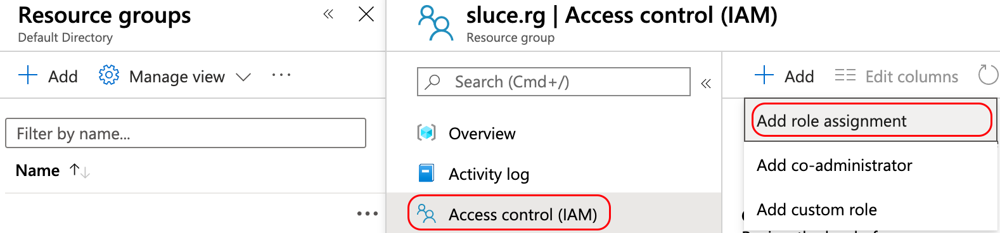
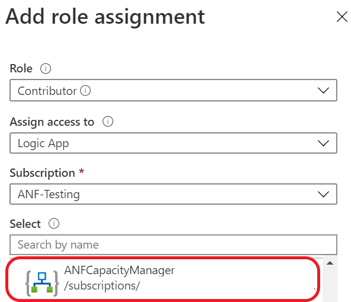
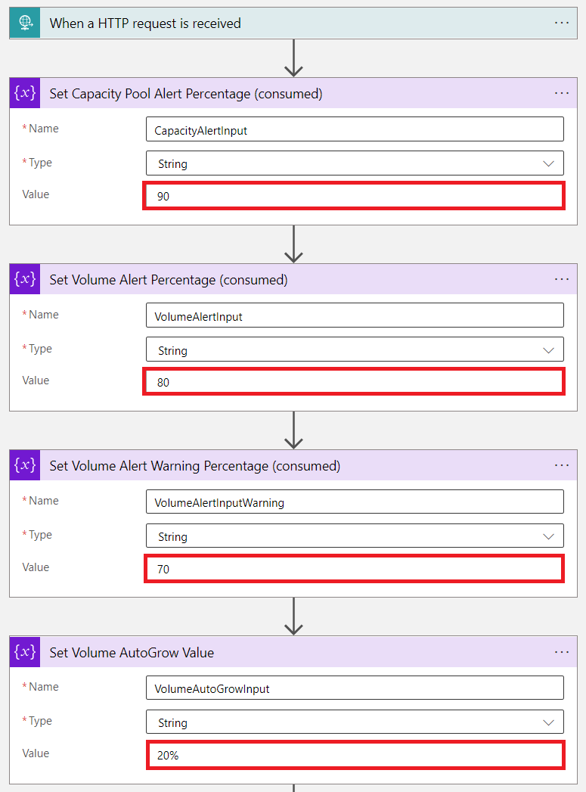

# ANFCapacityManager

 

**An Azure Logic App that manages capacity based alert rules and automatically increases volume sizes to prevent your Azure NetApp Files volumes from running out of space.**

## Change Log

* April 16, 2021 - Added NetApp Account name to Metric Rules names to guarantee resource name uniqueness.
* April 12, 2021 - Added logic to check if pool resize is complete before attempting to resize volume. Changed 'put' methods to 'patch' to avoid wiping out tags and snapshot policies.
* March 14, 2021 - CRR Source Volumes; added logic to autogrow function to increase CRR target capacity pool if required. Logic App will need contributor access to target volume's resource group.
* March 3, 2021  - Change volume metric from "Volume Consumed Size" to "Percentage Volume Consumed Size"

## Alert Management

* When an Azure NetApp Files Capacity Pool or Volume is created, ANFCapacityManager creates a metric alert rule based on the specified percent consumed threshold.
* When an Azure NetApp Files Capacity Pool or Volume is resized, ANFCapacityManager modifies the metric alert rule based on the specified percent capacity consumed threshold. If the alert rule does not exist, it will be created.
* When an Azure NetApp Files Capacity Pool or Volume is deleted, the corresponding metric alert rule will be deleted.

## Capacity Management (New!)

* Optionally, when an Azure NetApp Files Volume reaches the specified percent consumed threshold, the volume quota (size) will be increased by the percent specified between 10-100%.
* If increasing the volume size exceeds the capacity of the containing capacity pool, the capacity pool size will also be increased to accomodate the new volume size.
* Because CRR target volumes will be increased to match the source, ANFCapacityManager will now verify there is sufficient space in the target volume's capacity pool and increase capacity as needed.
* For an exmaple of how this works, click [here](./ResizeWorkflow.md).

## Prerequisites and Permissions

* The Logic App will need 'contributor' access to your ANF resrouce group (or subscription) and 'contributor' access to the resource group where it will be creating the alerts as well as the resource group it is deployed to.

* You will need to have an Alert Action group already created prior to installing the Logic App. This Action group will be associated with all capacity based alerts that get created by the Logic App. This action group is triggered when a Capacity Pool or Volume has reached the full threshold. This Alert Action group should probably notify the appropriate people via email or SMS.

## **Disclaimer**

**This logic app (ANFCapacityManager) is provided as is and is not supported by NetApp or Microsoft. You are encouraged to modify to fit your specific environment and/or requirements. It is strongly recommended to test the functionality before deploying to any business critical or production environments.**

## Installation

## **IMPORTANT: Follow all installation steps completely!**  

1. **Click the button above to deploy this Logic App to Azure.** Complete the following fields:

   * **Resource group** - this is where the Logic App will be deployed.
   * **Location** - this is the region where your Logic App will be deployed.
   * **Logic App Name** - any name you would like, the default is recommended.
   * **Target Resource Group for Alerts** - new alerts will be created in this resource group.
   * **Target Resource Group to Monitor** - leave this field blank to monitor your entire subscription.
   * **Capacity Pool % Full Threshold** - This determines the consumed threshold that triggers an alert for capacity pools. A value of 90 would cause an alert to be triggered when the capacity pool reaches 90% consumed.
   * **Volume % Full Threshold** - This determines the consumed threshold that triggers an alert for volumes. A value of 80 would cause an alert to be triggered when the volume reaches 80% consumed.
   * **Existing Action Group's Resource Group** - this is the resource group that contains your **_existing_** Action Group.
   * **Existing Action Group for Capacity Notifications** - this is the action group that will be triggered for capacity based alerting. This should be pre-created by you. This action group could send email/sms, or anything else you would like.
   * **AutoGrow Percent Increase** - Percent (of the existing volume size) to automatically grow a volume if it reaches the % Full Threshold specified above. A value of 0 (zero) will disable the AutoGrow feature. A value between 10 and 100 is recommended.

2. **Give your new Logic App permissions to read, create, and modify resources within your environment:** Navigate to Resource groups, choose the resource group that you specified for 'Target Resource Group for Alerts'. Choose 'Access control (IAM)' from the menu. Click the '+ Add' button and choose 'Add role assignment'. For the 'Role', choose Contributor. For 'Assign access to', choose Logic App, now select 'ANFCapacityManager' (or the name you specified in step 1). Finally, click the 'Save' button. **Repeat as needed to give the Logic App the required access:**
   * **Resource Group containing ANFCapacityManager**: 'Contributor'
   * **Resource Group where Alert Rules will be created**: 'Contributor'
   * **Subscription (or Resource Group) being monitored**: 'Contributor'

   
   

3. **IMPORTANT: Run the Logic App manually to build the supporting resources:** Navigate to your Logic App and choose Run Trigger, Manual. Running the Logic App manually kicks off a special workflow that does the following:
   * Creates an Alert Group called '**ANF_LogicAppTrigger**\[_*monitor_rg]*', this alert group is called when any of the four below alerts are triggered. The alert group calls the logic app when a new volume or capacity pool is created, modified, or deleted.
   * Creates a Metric Alert rule called '**ANF_VolumeModified**\[_*monitor_rg]*' to trigger the Logic App whenever a volume is created or modified.
   * Creates an Alert called '**ANF_PoolModified**\[_*monitor_rg]*' to trigger the Logic App whenever a capacity pool is created or modified.
   * Creates an Alert called '**ANF_VolumeDeleted**\[_*monitor_rg]*' to trigger the Logic App whenever a volume is deleted.
   * Creates an Alert called '**ANF_PoolDeleted**\[_*monitor_rg]*' to trigger the Logic App whenever a pool is deleted.
   * **NEW! Creates capacity based Metric Alert rules for existing volumes and capacity pools.**
  
Once ANFCapacityManager is installed successfully you should experience the following behavior: When an Azure NetApp Files Capacity Pool or Volume is created, modified, or deleted, the Logic App will automatically create (or modify, or delete) a capacity based Metric Alert rule with the name '**ANF\_Pool\_*accountname*\_*poolname***' or '**ANF\_Vol\_*accountname*\_*poolname*\_*volname***'. In addition, if you provided a value greater than 0 (zero) for the '**AutoGrow Percent Increase**' field, the Logic App will automatically increase the volume capacity by the percent specified if a volume reaches the consumed threshold.'

## Modifying Alert Thresholds and AutoGrow Amount

You can modify the ANFCapacityManager capacity thresholds and AutoGrow percent as needed after deployment: Navigate back to Logic Apps, choose your Logic App, and select 'Logic app designer' from the left hand menu.

Modify the three variables as required:

* Set Capacity Pool Alert Percentage (consumed)
* Set Volume Alert Percentage (consumed)
* Set Volume AutoGrow Percent

**Trigger a manual run of the Logic App.** This will modify all of the existing Metric alert rules based on the new value specified.

Please reach out if you have any questions or feature requests.

I'd love to hear what you think of this Logic App. Say hello on [Twitter](https://twitter.com/seanluce).
