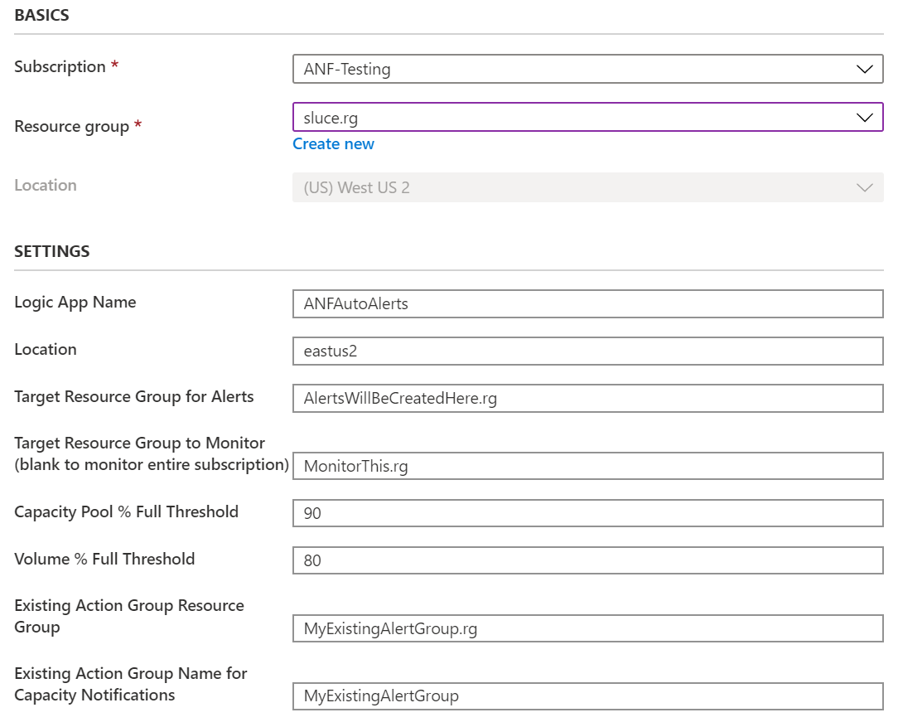
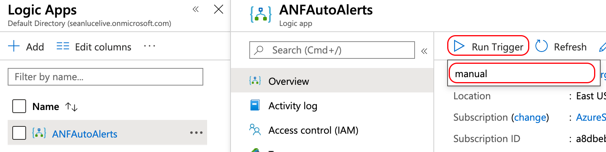

# ANFAutoAlerts

### An Azure Logic App that automates the creation, updating, and deleting of capacity based alerts for Azure NetApp Files.

### Things it does...

1. When an Azure NetApp Files Capacity Pool is created, ANFAutoAlerts creates an alert rule based on the specified percent capacity consumed.
2. When an Azure NetApp Files Volume is created, ANFAutoAlerts creates an alert rule based on the specified percent capacity consumed.
3. When an Azure NetApp Files Capacity Pool is resized, ANFAutoAlerts modifies an alert rule based on the specified percent capacity consumed. If the alert rule does not exist, it will be created.
4. When an Azure NetApp Files Volume is resized, ANFAutoAlerts modifies an alert rule based on the specified percent capacity consumed. If the alert rule does not exist, it will be created.
5. When an Azure NetApp Files Capacity Pool or Volume is deleted, the corresponding alert(s) will also be deleted.

### Things it does not do, that I would like it to do in the future

1. Act on existing Capacity Pools and Volumes
2. Allow for individual volume percent overrides via a tag or some other mechanism
3. **Suggestions?**

### Prerequisites and Permissions

The Logic App will need 'reader' access to your ANF resrouce group and 'contributor' access to the resource group where it will be creating the alerts as well as the resource group it is deployed to. If you are using the same resource group for all three, the Logic App will need 'contributor' access to that resource group.

You will need to have an Alert Action group already created prior to installing the Logic App. This Action group will be associated with all capacity based alerts that get created by the Logic App. As an exmaple, this action group may send an email or SMS alert when a Capacity Pool or Volume has reached the full threshold.

# Installation

**Note: the scope of this Logic App is a single Resoure Group to be monitored.**

1. Click the button above to deploy this Logic App to Azure. Complete the following fields:

	* *Resource group*; this is where the Logic App will be deployed.
	* *Location*; this is the region where your Logic App will be deployed.
	* *Logic App Name*, any name you would like, the default is recommended.
	* *Target Resource Group for Alerts*; new alerts will be created in this resource group.
	* *Target Resource Group to Monitor*; this is the resource group that will be monitored for new ANF resources.
   * *Capacity Pool % Full Threshold*; This determines the consumed threshold that triggers an alert for capacity pools. A value of 90 would cause an alert to be triggered when the capacity pool reaches 90% consumed.
   * *Volume % Full Threshold*; This determines the consumed threshold that triggers an alert for volumes. A value of 80 would cause an alert to be triggered when the volume reaches 80% consumed.
   * *Existing Action Group's Resource Group*; this is the resource group that contains your existing Action Group.
	* *Existing Action Group for Capacity Notifications*; this is the action group that will be triggered for capacity based alerting. This should be pre-created by you. This action group could send email/sms/webhook, or anything else you would like. If it doesn't exist at the time of deployment, that is fine, as long as you create it before you continue to step 2.

2. Give your new Logic App permissions to read, create, and modify resources within your resource group: Navigate to Resource groups, choose the resource group that you specified for 'Target Resource Group for Alerts'. Choose 'Access control (IAM)' from the menu. Click the '+ Add' button and choose 'Add role assignment'. For the 'Role', choose Contributor. For 'Assign access to', choose Logic App, now select 'ANFAutoAlerts' (or the name you specified in step 1). Finally, click the 'Save' button. Next, navigate to the resource group you specified for 'Target Resource Group to Monitor' and repeat to give the Logic App 'Reader' access to this resource group.

3. **IMPORTANT:** Run the Logic App manually to build the supporting resources: Navigate to your Logic App and choose Run Trigger, Manual.
   Running the Logic App manually kicks off a special workflow that does the following:
   
   * Creates an Alert Group called 'ANFAA_LogicAppTrigger\_*monitor_rg*', this alert group calls the logic app when a new volume or capacity pool is created, modified, or deleted.
   * Creates an Alert called 'ANFAA_VolumeModified\_*monitor_rg*' to trigger the Alert Group whenever a volume is created or modified.
   * Creates an Alert called 'ANFAA_PoolModified\_*monitor_rg*' to trigger the Alert Group whenever a capacity pool is created or modified.
   * Creates an Alert called 'ANFAA_VolumeDeleted\_*monitor_rg*' to trigger the Alert Group whenever a volume is deleted.
   * Creates an Alert called 'ANFAA_PoolDeleted\_*monitor_rg*' to trigger the Alert Group whenever a pool is deleted.
   

That's it! When you create, modify, or delete a capacity pool or volume, the Logic App will automatically create (or modify, or delete) a capacity based alert with the name 'ANFAA\_Pool\_*poolname*' or 'ANFAA\_Volume\_*poolname*_*volname*'. Make sure you test functionality by creating a capacity pool and volume and verifying that the alerts get created.

You can modify the ANFAutoAlerts capacity threshholds as needed after deployment: Navigate back to Logic Apps, choose your Logic App, and select 'Logic app designer'. 
	
Modify the two variables as needed:

   * Set Capacity Pool Alert Percentage (consumed)
      * default is 90 (90%)
   * Set Volume Alert Percentage (consumed)
      * default is 80 (80%) 

For this to have an effect on existing volumes, you will need to resize them to trigger the Logic App.

Please reach out if you have any questions or feature requests.

I'd love to hear what you think of this Logic App. Say hello on [Twitter](https://twitter.com/seanluce).
