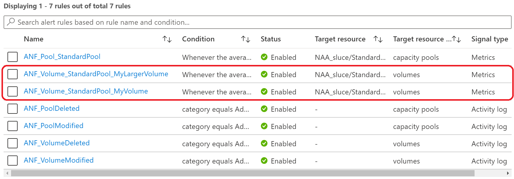

# Volume AutoGrow Workflow Example

Once the Logic App is successfully installed, four 'Activity log' alert rules are created. These four alert rules monitor the activity log for new, modified, or deleted Azure NetApp Files resources.

The Logic App creates an Action group called 'ANF_LogicAppTrigger' which is reponsible for calling the Logic App when any of the four rules above are triggered OR when a volume reaches a configured capacity threshold. The second Action group, 'capacityfullnotification' is used to notify your team when a capacity threshold is reached. This Action group needs to be provided by you.

A new ANF Capacity Pool is created:

The Logic App is triggered and the alert rule 'ANF_Pool_StandardPool' is automatically created.

Two new ANF Volumes are created; 'MyLargerVolume' which is 3.9TiB (3996 GiB) and 'MyVolume' which is 100 GiB:

The Logic App automatically creates two additional alert rules; one for each volume.

Notice that our 4TiB Capacity Pool is 100% allocated: 3996GiB + 100GiB = 4096GiB / 1024GiB = 4TiB  

We now write data to 'MyVolume' crossing the specified consumed threshold and the Alert rule, 'ANF_Volume_StandardPool_MyVolume', is triggered. This Alert rule calls the Logic App. The Logic app will increase the volume quota by ten percent. Before increasing the volume quota it will first verify that the containing capacity pool has enough available space to accomodate the new volume size. In this case, it does not. The Logic App will first increase the pool size to accomodate the new volume size by making the following API call:

The capacity pool size has been increased by 1TiB (from 4TiB to 5TiB) in this example:

Next, the Logic App makes an API call to increase the size of the volume by ten percent:

The volume size has been increased by 10GiB (from 100GiB to 110GiB) in this example:

